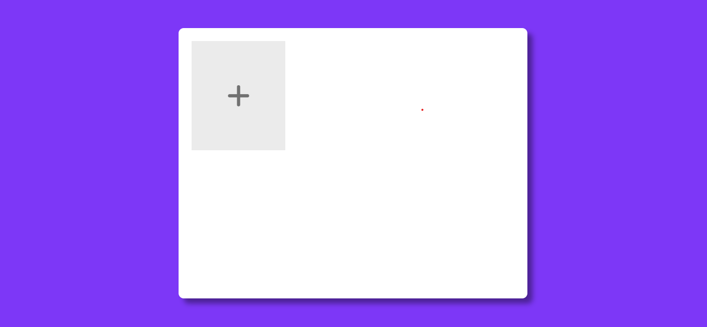
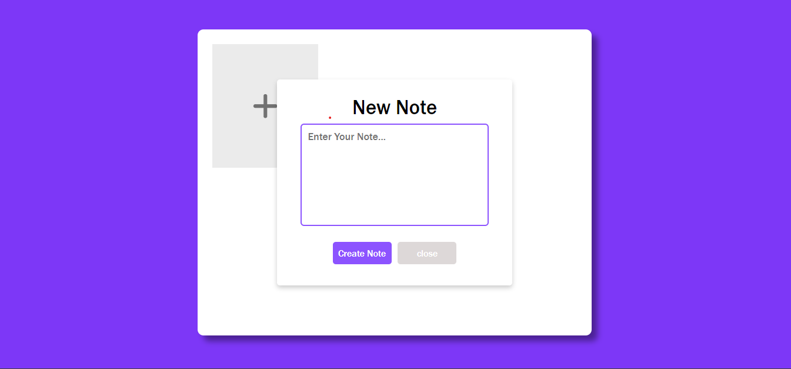
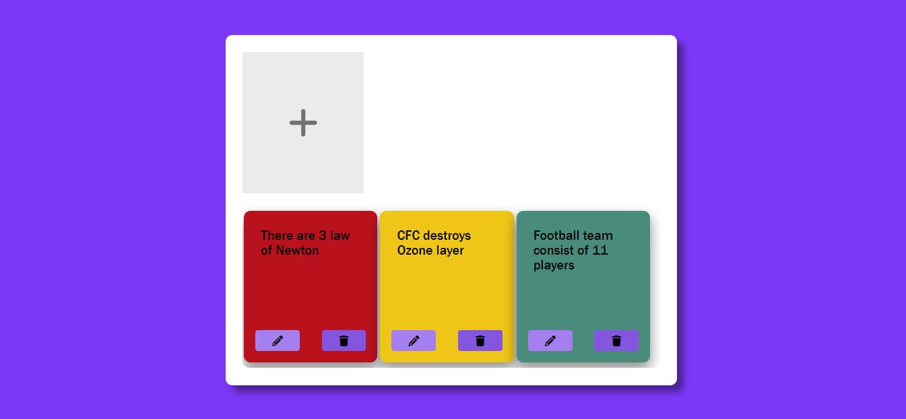
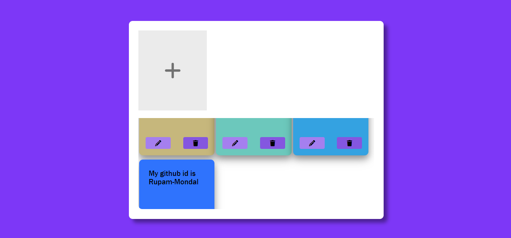
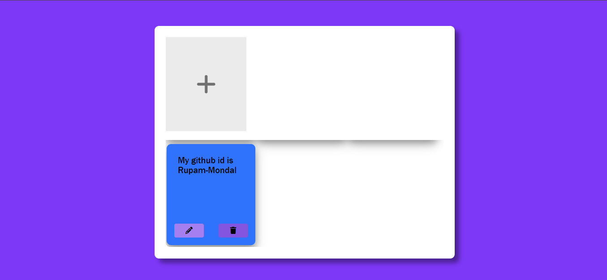

# Sticky Note Taking Web App

Welcome to my sticky note taking web app! This app allows you to create and organize your digital sticky notes in a convenient and user-friendly manner.

## Demo
- [click here](https://669d096501711873a2b7cd38--comforting-kheer-8f431b.netlify.app/)

## Features

- Create and customize sticky notes with different colors.
- Edit and delete notes with ease.

## Installation

To use this app, follow these steps:

1. Clone the repository to your local machine.
2. Open the `index.html` file in your preferred web browser.
3. Start creating and managing your sticky notes!

## Screenshots

Here are some screenshots of the app in action:

## Feedback and Contributions

If you have any feedback or suggestions for improving this app, please feel free to [open an issue](https://github.com/your-username/your-repo/issues) or [submit a pull request](https://github.com/your-username/your-repo/pulls). Your contributions are greatly appreciated!

Happy note-taking!
